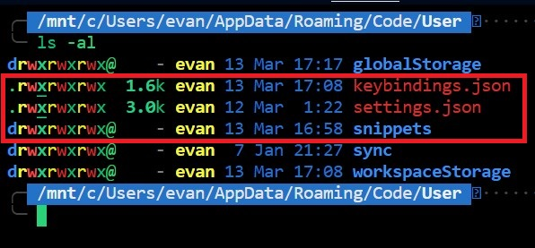

# VSCode Environment Setup

## Config file path

- **Linux**

  /home/evan/.config/Code/User/

- **Windows**

  C:\Users\evan\AppData\Roaming\Code\User\
  

## Install extensions

```sh
# Generate the extension list of the original environment
code --list-extensions | xargs -L 1 > extensions.txt

# Copy the 'extensions.txt' file to the new environment and run the script
# Make sure the path of 'extensions.txt' is same as the script
sh install-extensions.sh
```
